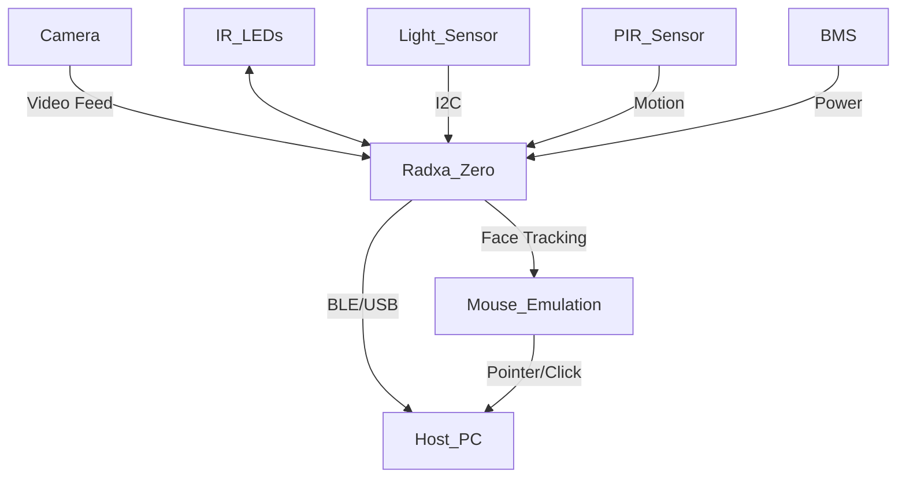
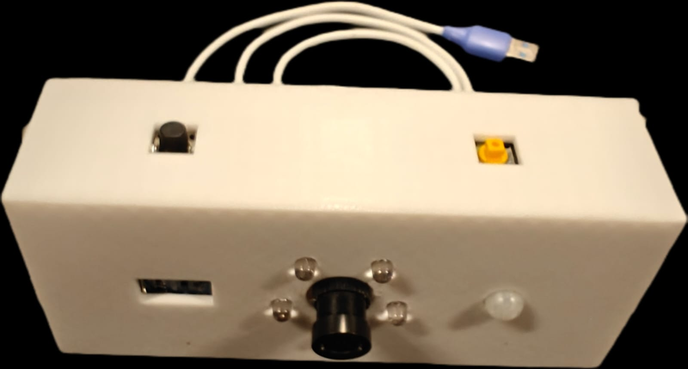

# HMouse: Head-Tracking Mouse Controller

**HMouse** is a head-mouse controller designed for hands-free computer interaction. It uses facial tracking to control the mouse pointer and perform clicks, with intelligent power, lighting, and motion-based management—ideal for accessibility solutions or hands-free control environments.

---

## Hardware Used

- **Radxa Zero 3W** (main SBC)
- **Raspberry Pi IR-cut camera** (for face & gesture tracking)
- **IR LEDs** (for night vision/low-light operation)
- **Light Intensity Sensor** (detects ambient lighting, controls IR LEDs)
- **PIR Motion Sensor** (detects presence/motion for automatic power saving)
- **Simple BMS** (battery management for charging and safety)
- **5000mAh Li-ion battery** (portable power source)

---

## Features

- **Face Tracking Mouse Control:**  
  - Uses camera and MediaPipe to track head/face movement.
  - Moves mouse pointer and performs clicks (left click with mouth open, right click with both eyes closed).

- **Dual Mode Connectivity:**  
  - Operates as both BLE (Bluetooth Low Energy) and USB mouse.
  - Automatic switching possible based on hardware interrupt.

- **Intelligent Lighting:**  
  - Light sensor automatically turns IR LEDs on/off for optimal camera vision.

- **Motion-Based Power Management:**  
  - **PIR motion sensor** detects user presence.
  - If no motion is detected for a specified timeout, the device enters power-saving (suspend) mode automatically.

- **Battery & Power Management:**  
  - Integrated BMS for safe charging/discharging.
  - Designed for long battery life and safety.

---

## Software Overview

- **Main Entry Point:** `app.py`
  - Launches multiprocessing: face tracking, BLE/USB server, sensor monitoring.
  - Integrates MediaPipe, OpenCV, and custom hardware modules.
  - Manages power-saving state via PIR motion sensor.

- **Core Modules:**
  - `mouse/btfpy`, `zero_hid`: BLE/USB mouse emulation
  - `g_helper`, `combined_helper`: Camera and face processing helpers
  - `sensor_lib`: Light and motion sensor interface

---

## Getting Started

### Hardware Setup

1. **Assemble Components:**
    - Connect camera, IR LEDs, light sensor, and PIR motion sensor to Radxa Zero 3W as per their respective pinouts.
    - Integrate BMS with the battery and power lines.
2. **Mount System:**  
   - Ensure camera and PIR sensor have a clear field of view.
   - Secure IR LEDs near camera lens for optimal illumination.

### Software Setup

1. **Install Dependencies:**
    ```bash
    sudo apt-get update
    sudo apt-get install python3-opencv python3-pip
    pip3 install mediapipe numpy
    ```
    - Additional modules may be required from this repo or subfolders.
2. **Clone Repository:**
    ```bash
    git clone https://github.com/mridul-santhosh/hmouse.git
    cd hmouse
    ```

3. **Run the Application:**
    ```bash
    python3 app.py
    ```
    - The script will start face tracking, initialize sensors, and run BLE/USB mouse services.

---

## Usage

- **Pointer Control:** Move your head to move the cursor.
- **Left Click:** Open your mouth.
- **Right Click:** Close both eyes for >0.5 seconds.
- **Switch BLE/USB:** Trigger the hardware interrupt (e.g., button press or sensor).
- **Power Saving:** If you leave the area and the PIR sensor detects no motion for a set period, the device will suspend to save power.
- **Quit:** Press 'q' in the OpenCV window or Ctrl+C.

---

## System Architecture



---

## File Structure

- `app.py` - Main entry point, process orchestration, motion/power management
- `mouse/` - BLE/USB mouse emulation code
- `g_helper.py`, `combined_helper.py` - Face tracking utilities
- `sensor_lib.py` - Sensor interface (light and PIR motion)
- (Other hardware abstraction and helper scripts/modules)

---

## Power and Safety Notes

- Ensure BMS is correctly wired for battery safety.
- Use a heatsink on Radxa Zero 3W for extended operation.
- Always test the camera and sensor connections before running unattended.

---




## Future Enhancements

- Add more facial gestures for additional mouse/keyboard actions.
- Web-based configuration and calibration.
- Enhanced low-light performance and battery statistics display.

---

## License

[MIT License](LICENSE)

---

## Acknowledgements

- [MediaPipe](https://mediapipe.dev/)
- [OpenCV](https://opencv.org/)
- Radxa & Raspberry Pi communities

---

## Contact
Please keep in mind that this project was completed in a relatively short period of time, therefore there is still potential for optimization and there may be some issues.
For issues or feature requests, please open an [issue on GitHub](https://github.com/mridul-santhosh/hmouse/issues).
