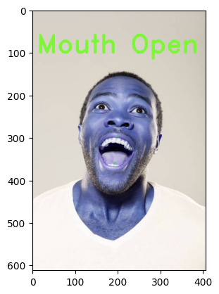

# **Head Pose Detection using MediaPipe**

Welcome to our study case on head pose detection using MediaPipe! This project demonstrates real-time head pose estimation by leveraging MediaPipe's advanced face landmark detection capabilities. 

By accurately tracking facial features, this system can determine the orientation of the head, making it ideal for applications in augmented reality (AR), virtual reality (VR), and human-computer interaction. 

Within this repository, you'll find the complete code, detailed documentation, and practical examples to help you understand and implement head pose detection in your projects. Dive in to explore how cutting-edge AI and machine learning techniques can be applied to enhance interactive experiences.

## Detections List
1. Face Mesh Creation

    

2. Pose State (Forward, Left, Right, Up, Down)
    
    

3. Mouth State (Open/Close)
    
    

4. Eyes State (Open/Close)
    
    

> NOTE: Processed image are using Mirror POV